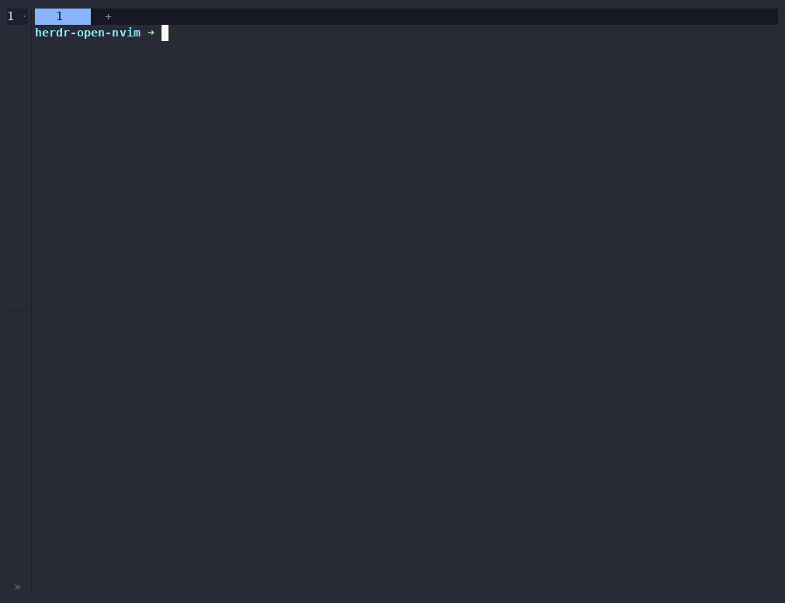
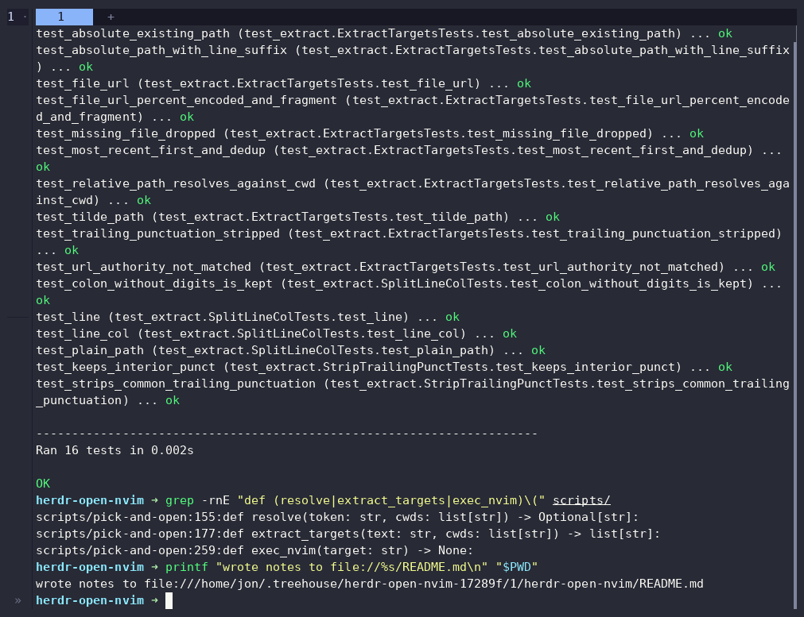
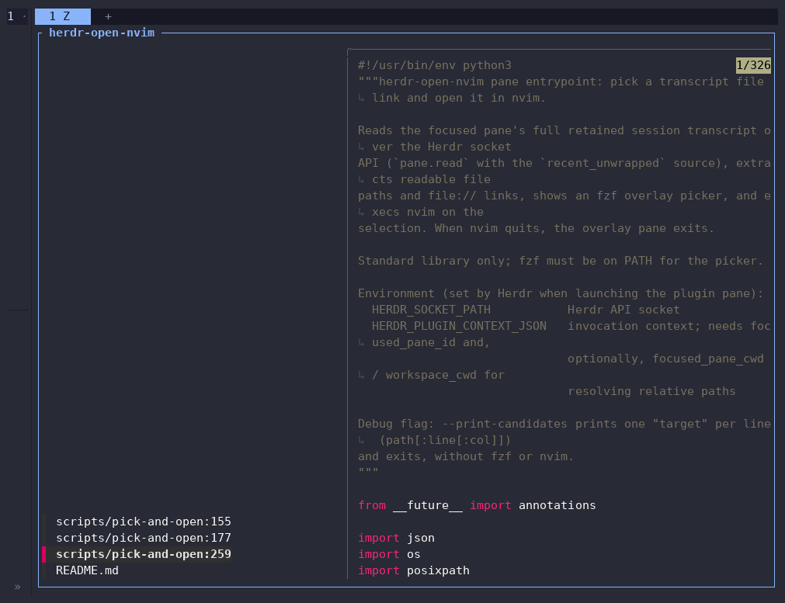
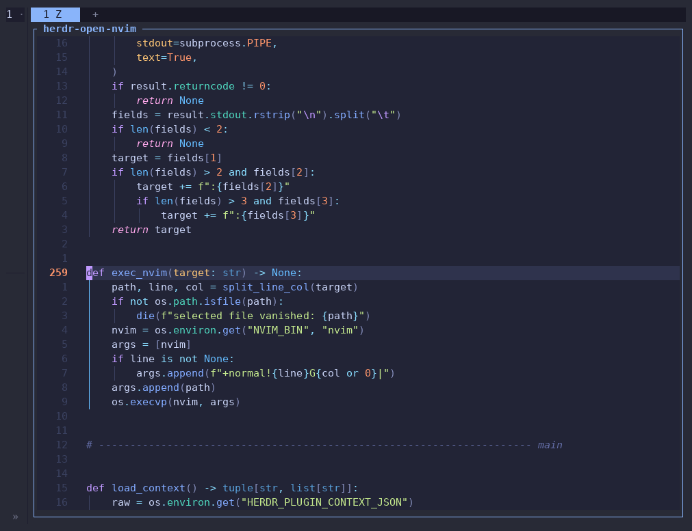

# herdr-open-nvim

Herdr plugin: extract readable file links from the session transcript and open
them in nvim (`prefix+e`).

## Demo

`prefix+e` on a pane whose transcript mentions `scripts/pick-and-open:259`,
straight into nvim on line 259:





A verbose test run and a couple of greps leave `path:line` references and a
`file://` link in the pane's scrollback.



`prefix+e` scans the full retained transcript - not just the viewport - and
offers every link that resolves to a readable file, newest first, with a preview.



Picking `scripts/pick-and-open:259` opens nvim on line 259 inside the overlay;
quitting nvim closes it.

Re-record the GIF with `docs/demo/record-demo.sh` (needs `asciinema` and `agg`;
it drives a throwaway named Herdr session, so your own session is untouched).

Press the binding on any pane and the plugin reads that pane's full retained
session transcript (not just the viewport), collects file paths and `file://`
links that resolve to existing readable files, and shows an fzf overlay with a
file preview. Picking one opens it in nvim inside the overlay, at the
`path:line:col` position when the transcript mentions one. Quitting nvim
closes the overlay.

## How it works

- `scripts/open-picker`: action launcher; opens the plugin overlay pane via
  `herdr plugin pane open` (falls back from a stale `HERDR_BIN_PATH` to `herdr`
  on `PATH`).
- `scripts/pick-and-open`: pane entrypoint. Reads the transcript over the
  Herdr socket API with `pane.read` source `recent_unwrapped` - never
  degrading to viewport-only sources - extracts candidates, and execs nvim.
  Python 3 standard library only.

Extraction accepts absolute paths, `~/` and `./`/`../`-relative paths, and
workspace-relative paths, optionally with `:line` or `:line:col` suffixes, plus
`file://` URIs (percent-encoding and `#fragments` handled). A candidate is
offered only if it exists and is readable; paths are resolved against the
focused pane's cwd, then the workspace cwd. Candidates are listed most
recently mentioned first. Bare filenames without a directory component are not
extracted (too noisy).

## Install (local-only)

No GitHub remote; link the repo directly:

```sh
herdr plugin link /path/to/herdr-open-nvim
```

Requirements: `python3`, `fzf`, `nvim` on the host running Herdr.

## Bind it to prefix+e

Stock Herdr binds `edit_scrollback` to `prefix+e`; free it first, then map the
plugin action. In `~/.config/herdr/config.toml`:

```toml
[keys]
edit_scrollback = ""    # free prefix+e (stock "edit scrollback in $EDITOR")

[[keys.command]]
key = "prefix+e"
type = "plugin_action"
command = "herdr-open-nvim.open"
description = "open transcript file in nvim"
```

Then `herdr server reload-config` (or restart the session).

## Caveats

- Alt-screen panes (TUIs such as vim or less) keep no host scrollback; the
  plugin prints a note and can only extract from the current viewport content.
- The server caps transcript reads at a bounded line count, so very old
  transcript content may not be scanned; the plugin prints a note when the
  read was truncated.
- Files on a different host than the one running Herdr cannot resolve and are
  dropped.

## Testing

```sh
python3 -m unittest discover -s tests   # extraction unit tests (no socket, no TTY)
```

For a live end-to-end pass without registering a dev plugin into the shared
registry, drive the entrypoint directly against a Herdr session socket:

```sh
HERDR_SOCKET_PATH=/path/to/herdr.sock \
HERDR_PLUGIN_CONTEXT_JSON='{"focused_pane_id":"...","focused_pane_cwd":"/tmp"}' \
  ./scripts/pick-and-open --print-candidates
```

`--print-candidates` prints one `path[:line[:col]]` target per line and exits,
without fzf or nvim.
